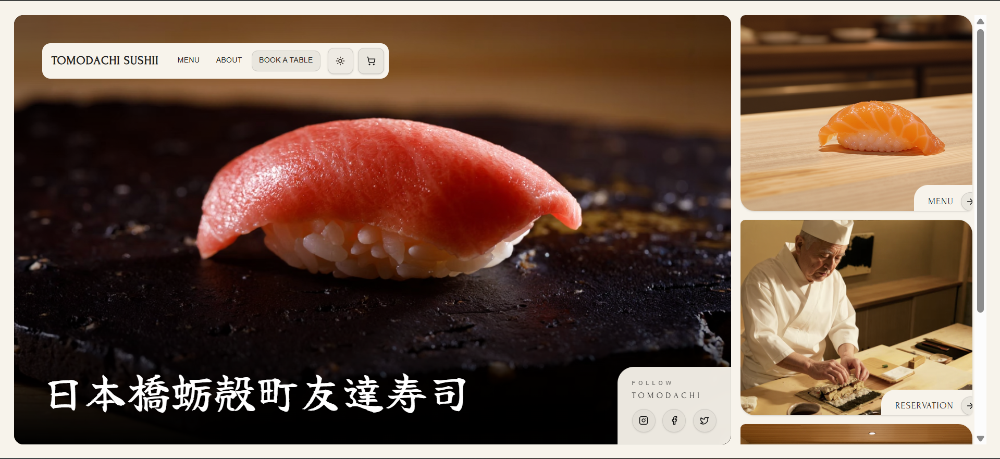
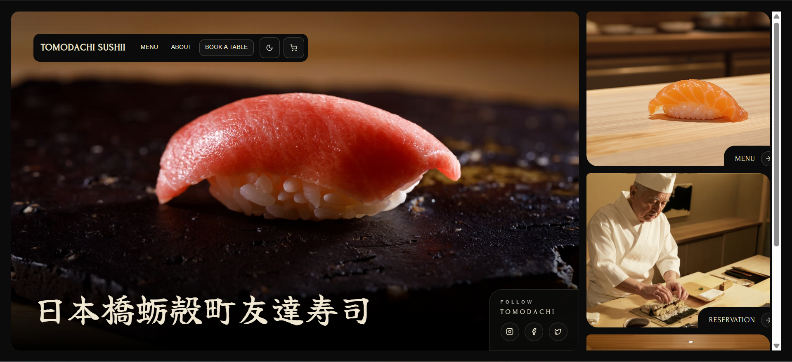

# Crave.js — Sushi Storefront Template

Tomodachi Sushi is a production-ready Crave.js storefront template built with Next.js 15, React 19, and Tailwind CSS. It ships with menu rendering, product detail dialogs, a mobile-friendly cart and checkout flow, and location-aware configuration so restaurants can launch online ordering experiences quickly on Vercel.

## Key Features

- **CraveUp Ordering** – Integrates the CraveUp storefront SDK for menu data, cart mutations, and checkout handoffs.
- **Responsive Menu UX** – Sticky category tabs, scroll-linked sections, and product dialogs optimized for both desktop and mobile.
- **Cart & Recommendations** – Full cart sidebar with quantity controls, suggestions carousel, and checkout CTA.
- **Dark & Light Themes** – Brandable palettes defined in CSS custom properties with instant theme toggling.
- **Accessible Components** – Built on shadcn/ui + Radix primitives with Drawer/Dialog parity and keyboard support.
- **Vercel Ready** – Zero-config deployment; includes `pnpm` scripts for dev, build, lint, and production start.

## Demo

| Hero (Light) | Hero (Dark) |
| --- | --- |
|  |  |

| Menu Grid | Product Drawer |
| --- | --- |
|  |  |

| Cart & Recommendations | Light/Dark Scroll GIF | Menu Scroll GIF |
| --- | --- | --- |
|  |  |  |

## Tech Stack

- [Next.js 15 (App Router)](https://nextjs.org/)
- [React 19](https://react.dev/)
- [TypeScript](https://www.typescriptlang.org/)
- [Tailwind CSS](https://tailwindcss.com/) with custom tokens
- [shadcn/ui](https://ui.shadcn.com/) + Radix UI primitives
- [CraveUp Storefront SDK](https://docs.craveup.com/)

## Getting Started

1. **Clone the repo**
   ```bash
   git clone --depth 1 https://github.com/your-org/tomodachi-sushi-template
   cd tomodachi-sushi-template
   ```
2. **Install dependencies**
   ```bash
   pnpm install
   ```
3. **Configure environment variables** (see next section).
4. **Run the dev server**
   ```bash
   pnpm dev
   ```
   Visit `http://localhost:3000` to explore the template.

## Environment Variables

Create a `.env.local` file with the following values from your CraveUp dashboard:

```bash
NEXT_PUBLIC_CRAVEUP_API_KEY=pk_xxx
NEXT_PUBLIC_LOCATION_ID=loc_xxx
```

> Need keys? Email [hello@craveup.com](mailto:hello@craveup.com) for sandbox access.

## Scripts

| Command          | Description                         |
| ---------------- | ----------------------------------- |
| `pnpm dev`       | Run the local development server    |
| `pnpm build`     | Create an optimized production build |
| `pnpm start`     | Serve the production build locally  |
| `pnpm lint`      | Run ESLint                          |

## Customization Guide

1. **Branding & Assets** – Replace imagery in `public/images/` with your restaurant photography.  
2. **Colors & Typography** – Update CSS variables in `src/app/globals.css` to match your brand system.  
3. **Menu Content** – Manage categories and items via the CraveUp dashboard; the template consumes live data via the storefront SDK.  
4. **Components** – Extend UI patterns inside `src/components/crave-ui` and `src/app/components`.  
5. **Deploy** – Push to Git and import the repo into Vercel. Set the same environment variables in your Vercel project and deploy.

## Project Structure

```
.
├── src
│   ├── app
│   │   ├── page.tsx, about/, menu/, reservation/  # App Router pages
│   │   ├── components/                            # Navbar, cards, layout primitives
│   │   └── globals.css                            # Tailwind + theme tokens
│   ├── components
│   │   ├── crave-ui/cart-component/               # Cart sidebar, counter button, etc.
│   │   └── ui/                                    # shadcn/ui wrappers
│   ├── hooks/                                     # Cart + ordering session hooks
│   ├── lib/                                       # API clients, utilities
│   └── store/                                     # Zustand cart store
├── public
│   ├── images/                                    # Brand imagery
│   └── screenshots/                               # README visuals
└── README.md
```

## Deployment on Vercel

1. Commit and push your changes.  
2. Go to [vercel.com/new](https://vercel.com/new) and import the repository.  
3. Add the CraveUp environment variables to the project settings.  
4. Click **Deploy** – Vercel builds the template and provides the live storefront URL.

## Support & Reference

- [CraveUp Docs](https://docs.craveup.com/)
- [Next.js Documentation](https://nextjs.org/docs)
- [Tailwind CSS Docs](https://tailwindcss.com/docs)
- [shadcn/ui Documentation](https://ui.shadcn.com/)

## License

Distributed under the [MIT License](LICENSE) © Crave Up Inc.

Happy building, and enjoy launching your sushi storefront! 🍣
